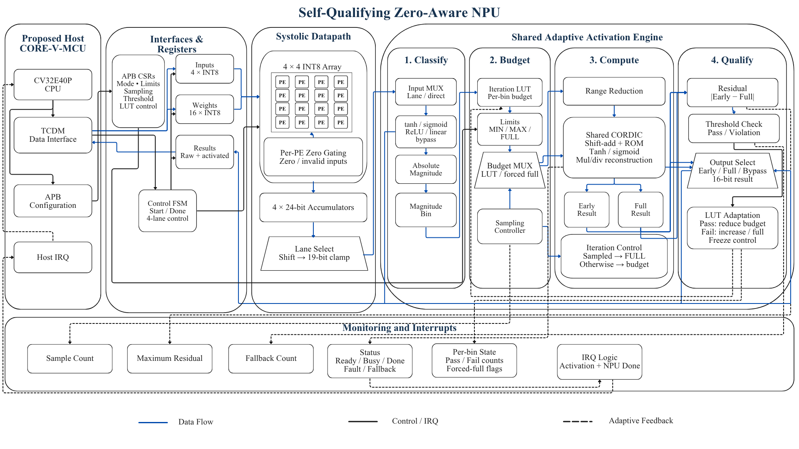

# Self-Qualifying Zero-Aware NPU

A SystemVerilog accelerator IP combining a **4 × 4 INT8 systolic array** with a **shared adaptive CORDIC activation engine**, targeting peripheral integration with OpenHW CORE-V-MCU (CV32E40P).

## System Architecture



## Key Features

- **Zero-aware computation:** per-PE operand isolation for zero or invalid activations, with 24-bit accumulation.
- **Four activation modes:** tanh, sigmoid, ReLU, and linear.
- **Adaptive iterations:** magnitude-based budgets, sampled early/full-result comparison, and fallback.
- **Shared activation engine:** sequential processing of four output lanes.
- **Interfaces:** APB configuration, TCDM-style data access, status counters, and interrupts.

## Data Flow

```text
Weights + Inputs → Systolic Array → Shift & Saturate
                → Activation Engine → Output Registers
```

Sampled activation requests compare early and full-iteration results against a configurable threshold. Passing samples can reduce the iteration budget; violations select the full result and increase the budget or force full iterations.

## Repository

- [`Phase1_Bitmodel/`](Phase1_Bitmodel/) — fixed-point model and test vectors.
- [`Phase2_ RTL/`](Phase2_%20RTL/) — datapath, adaptive controller, interfaces, and verification.

RTL entry point: [`accelerator_top.sv`](Phase2_%20RTL/integration_rtl/accelerator_top.sv).

## Simulation

Requires Cadence Xcelium and C shell with the simulator environment configured.

```csh
cd "Phase2_ RTL/uvm_tb/sim"
csh run.csh check   # Check source paths
csh run.csh uvm     # Run UVM verification
csh run.csh wave    # Open interactive waveforms
```
Waveform mode pauses at 5 µs and is not a completed regression.
